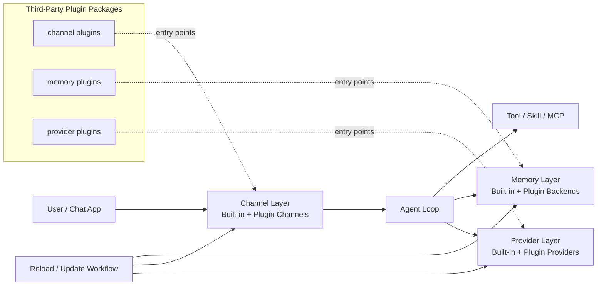

<div align="center">
  
  <h1>LegoNanobot: Pluginized Nanobot Architecture</h1>
</div>

**LegoNanobot** is a pluginized refactor of nanobot, focused on third-party extensibility and rapid customization.

Upstream nanobot project: https://github.com/HKUDS/nanobot

It keeps nanobot's lightweight core while making `channel`, `memory`, and `provider` capabilities modular and easier to evolve.

## Key Features of LegoNanobot

- **Pluginized core**: `channel`, `memory`, and `provider` are extension points with clear boundaries.
- **Third-party friendly**: build and ship integrations as standalone Python packages.
- **Hot-update oriented**: plugin loading/reload workflow reduces core changes and speeds up iteration.
- **Backward-compatible mindset**: preserve nanobot's small, understandable core while extending capabilities.

## 🏗️ Architecture



LegoNanobot decouples extension lifecycles from core logic, so custom channel/memory/provider capabilities can be delivered and iterated independently.

## Table of Contents

- [Key Features](#key-features-of-legonanobot)
- [Architecture](#️-architecture)
- [Extension Examples](#-extension-examples)
- [Features](#-features)
- [Install](#-install)
- [Quick Start](#-quick-start)
- [Chat Apps](#-chat-apps)
- [Agent Social Network](#-agent-social-network)
- [Configuration](#️-configuration)
- [Multiple Instances](#-multiple-instances)
- [CLI Reference](#-cli-reference)
- [Docker](#-docker)
- [Linux Service](#-linux-service)
- [Project Structure](#-project-structure)
- [Contribute & Roadmap](#-contribute--roadmap)
- [Star History](#-star-history)

## 🧩 Extension Examples

The repository includes three plugin examples for different extension surfaces:

### 1) Channel Plugin: DingTalk RichText

Path: `examples/channel-plugin-dingtalk-richtext/`

```bash
cd examples/channel-plugin-dingtalk-richtext
pip install -e .
```

Use it by configuring `channels.dingtalk_richtext` in your config (the legacy `channels.plugins.dingtalk_richtext` form is also supported).

### 2) Memory Plugin: SQLite Backend

Path: `examples/memory-plugin-sqlite/`

```bash
cd examples/memory-plugin-sqlite
pip install -e .
```

Use it by setting `memory.backend` to `sqlite_memory` (or `sqlite-memory`) and adding plugin config under `memory.plugins`.

### 3) Provider Plugin: Alibaba BaiLian

Path: `examples/provider-plugin-bailian/`

```bash
cd examples/provider-plugin-bailian
pip install -e .
nanobot provider reload
```

Use it by adding provider config under `providers.aliyun_bailian` in your config and selecting the plugin provider in `agents.defaults.provider` (the legacy `providers.plugins.aliyun_bailian` form is also supported).

## ✨ Features

<table align="center">
  <tr align="center">
    <th><p align="center">📈 24/7 Real-Time Market Analysis</p></th>
    <th><p align="center">🚀 Full-Stack Software Engineer</p></th>
    <th><p align="center">📅 Smart Daily Routine Manager</p></th>
    <th><p align="center">📚 Personal Knowledge Assistant</p></th>
  </tr>
  <tr>
    <td align="center"><p align="center"></p></td>
    <td align="center"><p align="center"></p></td>
    <td align="center"><p align="center"></p></td>
    <td align="center"><p align="center"></p></td>
  </tr>
  <tr>
    <td align="center">Discovery • Insights • Trends</td>
    <td align="center">Develop • Deploy • Scale</td>
    <td align="center">Schedule • Automate • Organize</td>
    <td align="center">Learn • Memory • Reasoning</td>
  </tr>
</table>

## 📦 Install

**Install from source** (latest features, recommended for development)

```bash
git clone https://github.com/HKUDS/nanobot.git
cd nanobot
pip install -e .
```

**Install with [uv](https://github.com/astral-sh/uv)** (stable, fast)

```bash
uv tool install nanobot-ai
```

**Install from PyPI** (stable)

```bash
pip install nanobot-ai
```

### Update to latest version

**PyPI / pip**

```bash
pip install -U nanobot-ai
nanobot --version
```

**uv**

```bash
uv tool upgrade nanobot-ai
nanobot --version
```

**Using WhatsApp?** Rebuild the local bridge after upgrading:

```bash
rm -rf ~/.nanobot/bridge
nanobot channels login
```

## 🚀 Quick Start

> [!TIP]
> Set your API key in `~/.nanobot/config.json`.
> Get API keys: [OpenRouter](https://openrouter.ai/keys) (Global)
>
> For web search capability setup, please see [Web Search](#web-search).

**1. Initialize**

```bash
nanobot onboard
```

**2. Configure** (`~/.nanobot/config.json`)

Add or merge these **two parts** into your config (other options have defaults).

*Set your API key* (e.g. OpenRouter, recommended for global users):
```json
{
  "providers": {
    "openrouter": {
      "apiKey": "sk-or-v1-xxx"
    }
  }
}
```

*Set your model* (optionally pin a provider — defaults to auto-detection):
```json
{
  "agents": {
    "defaults": {
      "model": "anthropic/claude-opus-4-5",
      "provider": "openrouter"
    }
  }
}
```

**3. Chat**

```bash
nanobot agent
```

That's it! You have a working AI assistant in 2 minutes.

## 💬 Chat Apps

Connect nanobot to your favorite chat platform.

| Channel | What you need |
|---------|---------------|
| **Telegram** | Bot token from @BotFather |
| **Discord** | Bot token + Message Content intent |
| **WhatsApp** | QR code scan |
| **Feishu** | App ID + App Secret |
| **Mochat** | Claw token (auto-setup available) |
| **DingTalk** | App Key + App Secret |
| **Slack** | Bot token + App-Level token |
| **Email** | IMAP/SMTP credentials |
| **QQ** | App ID + App Secret |
| **Wecom** | Bot ID + Bot Secret |

<details>
<summary><b>Telegram</b> (Recommended)</summary>

**1. Create a bot**
- Open Telegram, search `@BotFather`
- Send `/newbot`, follow prompts
- Copy the token

**2. Configure**

```json
{
  "channels": {
    "telegram": {
      "enabled": true,
      "token": "YOUR_BOT_TOKEN",
      "allowFrom": ["YOUR_USER_ID"]
    }
  }
}
```

> You can find your **User ID** in Telegram settings. It is shown as `@yourUserId`.
> Copy this value **without the `@` symbol** and paste it into the config file.


**3. Run**

```bash
nanobot gateway
```

</details>

<details>
<summary><b>Mochat (Claw IM)</b></summary>

Uses **Socket.IO WebSocket** by default, with HTTP polling fallback.

**1. Ask nanobot to set up Mochat for you**

Simply send this message to nanobot (replace `xxx@xxx` with your real email):

```
Read https://raw.githubusercontent.com/HKUDS/MoChat/refs/heads/main/skills/nanobot/skill.md and register on MoChat. My Email account is xxx@xxx Bind me as your owner and DM me on MoChat.
```

nanobot will automatically register, configure `~/.nanobot/config.json`, and connect to Mochat.

**2. Restart gateway**

```bash
nanobot gateway
```

That's it — nanobot handles the rest!

<br>

<details>
<summary>Manual configuration (advanced)</summary>

If you prefer to configure manually, add the following to `~/.nanobot/config.json`:

> Keep `claw_token` private. It should only be sent in `X-Claw-Token` header to your Mochat API endpoint.

```json
{
  "channels": {
    "mochat": {
      "enabled": true,
      "base_url": "https://mochat.io",
      "socket_url": "https://mochat.io",
      "socket_path": "/socket.io",
      "claw_token": "claw_xxx",
      "agent_user_id": "6982abcdef",
      "sessions": ["*"],
      "panels": ["*"],
      "reply_delay_mode": "non-mention",
      "reply_delay_ms": 120000
    }
  }
}
```


</details>

</details>

<details>
<summary><b>Discord</b></summary>

**1. Create a bot**
- Go to https://discord.com/developers/applications
- Create an application → Bot → Add Bot
- Copy the bot token

**2. Enable intents**
- In the Bot settings, enable **MESSAGE CONTENT INTENT**
- (Optional) Enable **SERVER MEMBERS INTENT** if you plan to use allow lists based on member data

**3. Get your User ID**
- Discord Settings → Advanced → enable **Developer Mode**
- Right-click your avatar → **Copy User ID**

**4. Configure**

```json
{
  "channels": {
    "discord": {
      "enabled": true,
      "token": "YOUR_BOT_TOKEN",
      "allowFrom": ["YOUR_USER_ID"],
      "groupPolicy": "mention"
    }
  }
}
```

> `groupPolicy` controls how the bot responds in group channels:
> - `"mention"` (default) — Only respond when @mentioned
> - `"open"` — Respond to all messages
> DMs always respond when the sender is in `allowFrom`.

**5. Invite the bot**
- OAuth2 → URL Generator
- Scopes: `bot`
- Bot Permissions: `Send Messages`, `Read Message History`
- Open the generated invite URL and add the bot to your server

**6. Run**

```bash
nanobot gateway
```

</details>

<details>
<summary><b>Matrix (Element)</b></summary>

Install Matrix dependencies first:

```bash
pip install nanobot-ai[matrix]
```

**1. Create/choose a Matrix account**

- Create or reuse a Matrix account on your homeserver (for example `matrix.org`).
- Confirm you can log in with Element.

**2. Get credentials**

- You need:
  - `userId` (example: `@nanobot:matrix.org`)
  - `accessToken`
  - `deviceId` (recommended so sync tokens can be restored across restarts)
- You can obtain these from your homeserver login API (`/_matrix/client/v3/login`) or from your client's advanced session settings.

**3. Configure**

```json
{
  "channels": {
    "matrix": {
      "enabled": true,
      "homeserver": "https://matrix.org",
      "userId": "@nanobot:matrix.org",
      "accessToken": "syt_xxx",
      "deviceId": "NANOBOT01",
      "e2eeEnabled": true,
      "allowFrom": ["@your_user:matrix.org"],
      "groupPolicy": "open",
      "groupAllowFrom": [],
      "allowRoomMentions": false,
      "maxMediaBytes": 20971520
    }
  }
}
```

> Keep a persistent `matrix-store` and stable `deviceId` — encrypted session state is lost if these change across restarts.

| Option | Description |
|--------|-------------|
| `allowFrom` | User IDs allowed to interact. Empty denies all; use `["*"]` to allow everyone. |
| `groupPolicy` | `open` (default), `mention`, or `allowlist`. |
| `groupAllowFrom` | Room allowlist (used when policy is `allowlist`). |
| `allowRoomMentions` | Accept `@room` mentions in mention mode. |
| `e2eeEnabled` | E2EE support (default `true`). Set `false` for plaintext-only. |
| `maxMediaBytes` | Max attachment size (default `20MB`). Set `0` to block all media. |


**4. Run**

```bash
nanobot gateway
```

</details>

<details>
<summary><b>WhatsApp</b></summary>

Requires **Node.js ≥18**.

**1. Link device**

```bash
nanobot channels login
# Scan QR with WhatsApp → Settings → Linked Devices
```

**2. Configure**

```json
{
  "channels": {
    "whatsapp": {
      "enabled": true,
      "allowFrom": ["+1234567890"]
    }
  }
}
```

**3. Run** (two terminals)

```bash
# Terminal 1
nanobot channels login

# Terminal 2
nanobot gateway
```

> WhatsApp bridge updates are not applied automatically for existing installations.
> After upgrading nanobot, rebuild the local bridge with:
> `rm -rf ~/.nanobot/bridge && nanobot channels login`

</details>

<details>
<summary><b>Feishu (飞书)</b></summary>

Uses **WebSocket** long connection — no public IP required.

**1. Create a Feishu bot**
- Visit [Feishu Open Platform](https://open.feishu.cn/app)
- Create a new app → Enable **Bot** capability
- **Permissions**: Add `im:message` (send messages) and `im:message.p2p_msg:readonly` (receive messages)
- **Events**: Add `im.message.receive_v1` (receive messages)
  - Select **Long Connection** mode (requires running nanobot first to establish connection)
- Get **App ID** and **App Secret** from "Credentials & Basic Info"
- Publish the app

**2. Configure**

```json
{
  "channels": {
    "feishu": {
      "enabled": true,
      "appId": "cli_xxx",
      "appSecret": "xxx",
      "encryptKey": "",
      "verificationToken": "",
      "allowFrom": ["ou_YOUR_OPEN_ID"],
      "groupPolicy": "mention"
    }
  }
}
```

> `encryptKey` and `verificationToken` are optional for Long Connection mode.
> `allowFrom`: Add your open_id (find it in nanobot logs when you message the bot). Use `["*"]` to allow all users.
> `groupPolicy`: `"mention"` (default — respond only when @mentioned), `"open"` (respond to all group messages). Private chats always respond.

**3. Run**

```bash
nanobot gateway
```

> [!TIP]
> Feishu uses WebSocket to receive messages — no webhook or public IP needed!

</details>

<details>
<summary><b>QQ (QQ单聊)</b></summary>

Uses **botpy SDK** with WebSocket — no public IP required. Currently supports **private messages only**.

**1. Register & create bot**
- Visit [QQ Open Platform](https://q.qq.com) → Register as a developer (personal or enterprise)
- Create a new bot application
- Go to **开发设置 (Developer Settings)** → copy **AppID** and **AppSecret**

**2. Set up sandbox for testing**
- In the bot management console, find **沙箱配置 (Sandbox Config)**
- Under **在消息列表配置**, click **添加成员** and add your own QQ number
- Once added, scan the bot's QR code with mobile QQ → open the bot profile → tap "发消息" to start chatting

**3. Configure**

> - `allowFrom`: Add your openid (find it in nanobot logs when you message the bot). Use `["*"]` for public access.
> - For production: submit a review in the bot console and publish. See [QQ Bot Docs](https://bot.q.qq.com/wiki/) for the full publishing flow.

```json
{
  "channels": {
    "qq": {
      "enabled": true,
      "appId": "YOUR_APP_ID",
      "secret": "YOUR_APP_SECRET",
      "allowFrom": ["YOUR_OPENID"]
    }
  }
}
```

**4. Run**

```bash
nanobot gateway
```

Now send a message to the bot from QQ — it should respond!

</details>

<details>
<summary><b>DingTalk (钉钉)</b></summary>

Uses **Stream Mode** — no public IP required.

**1. Create a DingTalk bot**
- Visit [DingTalk Open Platform](https://open-dev.dingtalk.com/)
- Create a new app -> Add **Robot** capability
- **Configuration**:
  - Toggle **Stream Mode** ON
- **Permissions**: Add necessary permissions for sending messages
- Get **AppKey** (Client ID) and **AppSecret** (Client Secret) from "Credentials"
- Publish the app

**2. Configure**

```json
{
  "channels": {
    "dingtalk": {
      "enabled": true,
      "clientId": "YOUR_APP_KEY",
      "clientSecret": "YOUR_APP_SECRET",
      "allowFrom": ["YOUR_STAFF_ID"]
    }
  }
}
```

> `allowFrom`: Add your staff ID. Use `["*"]` to allow all users.

**3. Run**

```bash
nanobot gateway
```

</details>

<details>
<summary><b>Slack</b></summary>

Uses **Socket Mode** — no public URL required.

**1. Create a Slack app**
- Go to [Slack API](https://api.slack.com/apps) → **Create New App** → "From scratch"
- Pick a name and select your workspace

**2. Configure the app**
- **Socket Mode**: Toggle ON → Generate an **App-Level Token** with `connections:write` scope → copy it (`xapp-...`)
- **OAuth & Permissions**: Add bot scopes: `chat:write`, `reactions:write`, `app_mentions:read`
- **Event Subscriptions**: Toggle ON → Subscribe to bot events: `message.im`, `message.channels`, `app_mention` → Save Changes
- **App Home**: Scroll to **Show Tabs** → Enable **Messages Tab** → Check **"Allow users to send Slash commands and messages from the messages tab"**
- **Install App**: Click **Install to Workspace** → Authorize → copy the **Bot Token** (`xoxb-...`)

**3. Configure nanobot**

```json
{
  "channels": {
    "slack": {
      "enabled": true,
      "botToken": "xoxb-...",
      "appToken": "xapp-...",
      "allowFrom": ["YOUR_SLACK_USER_ID"],
      "groupPolicy": "mention"
    }
  }
}
```

**4. Run**

```bash
nanobot gateway
```

DM the bot directly or @mention it in a channel — it should respond!

> [!TIP]
> - `groupPolicy`: `"mention"` (default — respond only when @mentioned), `"open"` (respond to all channel messages), or `"allowlist"` (restrict to specific channels).
> - DM policy defaults to open. Set `"dm": {"enabled": false}` to disable DMs.

</details>

<details>
<summary><b>Email</b></summary>

Give nanobot its own email account. It polls **IMAP** for incoming mail and replies via **SMTP** — like a personal email assistant.

**1. Get credentials (Gmail example)**
- Create a dedicated Gmail account for your bot (e.g. `my-nanobot@gmail.com`)
- Enable 2-Step Verification → Create an [App Password](https://myaccount.google.com/apppasswords)
- Use this app password for both IMAP and SMTP

**2. Configure**

> - `consentGranted` must be `true` to allow mailbox access. This is a safety gate — set `false` to fully disable.
> - `allowFrom`: Add your email address. Use `["*"]` to accept emails from anyone.
> - `smtpUseTls` and `smtpUseSsl` default to `true` / `false` respectively, which is correct for Gmail (port 587 + STARTTLS). No need to set them explicitly.
> - Set `"autoReplyEnabled": false` if you only want to read/analyze emails without sending automatic replies.

```json
{
  "channels": {
    "email": {
      "enabled": true,
      "consentGranted": true,
      "imapHost": "imap.gmail.com",
      "imapPort": 993,
      "imapUsername": "my-nanobot@gmail.com",
      "imapPassword": "your-app-password",
      "smtpHost": "smtp.gmail.com",
      "smtpPort": 587,
      "smtpUsername": "my-nanobot@gmail.com",
      "smtpPassword": "your-app-password",
      "fromAddress": "my-nanobot@gmail.com",
      "allowFrom": ["your-real-email@gmail.com"]
    }
  }
}
```


**3. Run**

```bash
nanobot gateway
```

</details>

<details>
<summary><b>Wecom (企业微信)</b></summary>

> Here we use [wecom-aibot-sdk-python](https://github.com/chengyongru/wecom_aibot_sdk) (community Python version of the official [@wecom/aibot-node-sdk](https://www.npmjs.com/package/@wecom/aibot-node-sdk)).
>
> Uses **WebSocket** long connection — no public IP required.

**1. Install the optional dependency**

```bash
pip install nanobot-ai[wecom]
```

**2. Create a WeCom AI Bot**

Go to the WeCom admin console → Intelligent Robot → Create Robot → select **API mode** with **long connection**. Copy the Bot ID and Secret.

**3. Configure**

```json
{
  "channels": {
    "wecom": {
      "enabled": true,
      "botId": "your_bot_id",
      "secret": "your_bot_secret",
      "allowFrom": ["your_id"]
    }
  }
}
```

**4. Run**

```bash
nanobot gateway
```

</details>

## 🌐 Agent Social Network

🐈 nanobot is capable of linking to the agent social network (agent community). **Just send one message and your nanobot joins automatically!**

| Platform | How to Join (send this message to your bot) |
|----------|-------------|
| [**Moltbook**](https://www.moltbook.com/) | `Read https://moltbook.com/skill.md and follow the instructions to join Moltbook` |
| [**ClawdChat**](https://clawdchat.ai/) | `Read https://clawdchat.ai/skill.md and follow the instructions to join ClawdChat` |

Simply send the command above to your nanobot (via CLI or any chat channel), and it will handle the rest.

## ⚙️ Configuration

Config file: `~/.nanobot/config.json`

### Providers

> [!TIP]
> - **Groq** provides free voice transcription via Whisper. If configured, Telegram voice messages will be automatically transcribed.
> - **VolcEngine / BytePlus Coding Plan**: Use dedicated providers `volcengineCodingPlan` or `byteplusCodingPlan` instead of the pay-per-use `volcengine` / `byteplus` providers.
> - **Zhipu Coding Plan**: If you're on Zhipu's coding plan, set `"apiBase": "https://open.bigmodel.cn/api/coding/paas/v4"` in your zhipu provider config.
> - **MiniMax (Mainland China)**: If your API key is from MiniMax's mainland China platform (minimaxi.com), set `"apiBase": "https://api.minimaxi.com/v1"` in your minimax provider config.
> - **Alibaba Cloud BaiLian**: If you're using Alibaba Cloud BaiLian's OpenAI-compatible endpoint, set `"apiBase": "https://dashscope.aliyuncs.com/compatible-mode/v1"` in your dashscope provider config.

| Provider | Purpose | Get API Key |
|----------|---------|-------------|
| `custom` | Any OpenAI-compatible endpoint (direct, no LiteLLM) | — |
| `openrouter` | LLM (recommended, access to all models) | [openrouter.ai](https://openrouter.ai) |
| `volcengine` | LLM (VolcEngine, pay-per-use) | [Coding Plan](https://www.volcengine.com/activity/codingplan?utm_campaign=nanobot&utm_content=nanobot&utm_medium=devrel&utm_source=OWO&utm_term=nanobot) · [volcengine.com](https://www.volcengine.com) |
| `byteplus` | LLM (VolcEngine international, pay-per-use) | [Coding Plan](https://www.byteplus.com/en/activity/codingplan?utm_campaign=nanobot&utm_content=nanobot&utm_medium=devrel&utm_source=OWO&utm_term=nanobot) · [byteplus.com](https://www.byteplus.com) |
| `anthropic` | LLM (Claude direct) | [console.anthropic.com](https://console.anthropic.com) |
| `azure_openai` | LLM (Azure OpenAI) | [portal.azure.com](https://portal.azure.com) |
| `openai` | LLM (GPT direct) | [platform.openai.com](https://platform.openai.com) |
| `deepseek` | LLM (DeepSeek direct) | [platform.deepseek.com](https://platform.deepseek.com) |
| `groq` | LLM + **Voice transcription** (Whisper) | [console.groq.com](https://console.groq.com) |
| `gemini` | LLM (Gemini direct) | [aistudio.google.com](https://aistudio.google.com) |
| `minimax` | LLM (MiniMax direct) | [platform.minimaxi.com](https://platform.minimaxi.com) |
| `aihubmix` | LLM (API gateway, access to all models) | [aihubmix.com](https://aihubmix.com) |
| `siliconflow` | LLM (SiliconFlow/硅基流动) | [siliconflow.cn](https://siliconflow.cn) |
| `dashscope` | LLM (Qwen) | [dashscope.console.aliyun.com](https://dashscope.console.aliyun.com) |
| `moonshot` | LLM (Moonshot/Kimi) | [platform.moonshot.cn](https://platform.moonshot.cn) |
| `zhipu` | LLM (Zhipu GLM) | [open.bigmodel.cn](https://open.bigmodel.cn) |
| `ollama` | LLM (local, Ollama) | — |
| `vllm` | LLM (local, any OpenAI-compatible server) | — |
| `openai_codex` | LLM (Codex, OAuth) | `nanobot provider login openai-codex` |
| `github_copilot` | LLM (GitHub Copilot, OAuth) | `nanobot provider login github-copilot` |

<details>
<summary><b>OpenAI Codex (OAuth)</b></summary>

Codex uses OAuth instead of API keys. Requires a ChatGPT Plus or Pro account.

**1. Login:**
```bash
nanobot provider login openai-codex
```

**2. Set model** (merge into `~/.nanobot/config.json`):
```json
{
  "agents": {
    "defaults": {
      "model": "openai-codex/gpt-5.1-codex"
    }
  }
}
```

**3. Chat:**
```bash
nanobot agent -m "Hello!"

# Target a specific workspace/config locally
nanobot agent -c ~/.nanobot-telegram/config.json -m "Hello!"

# One-off workspace override on top of that config
nanobot agent -c ~/.nanobot-telegram/config.json -w /tmp/nanobot-telegram-test -m "Hello!"
```

> Docker users: use `docker run -it` for interactive OAuth login.

</details>

<details>
<summary><b>Custom Provider (Any OpenAI-compatible API)</b></summary>

Connects directly to any OpenAI-compatible endpoint — LM Studio, llama.cpp, Together AI, Fireworks, Azure OpenAI, or any self-hosted server. Bypasses LiteLLM; model name is passed as-is.

```json
{
  "providers": {
    "custom": {
      "apiKey": "your-api-key",
      "apiBase": "https://api.your-provider.com/v1"
    }
  },
  "agents": {
    "defaults": {
      "model": "your-model-name"
    }
  }
}
```

> For local servers that don't require a key, set `apiKey` to any non-empty string (e.g. `"no-key"`).

</details>

<details>
<summary><b>Ollama (local)</b></summary>

Run a local model with Ollama, then add to config:

**1. Start Ollama** (example):
```bash
ollama run llama3.2
```

**2. Add to config** (partial — merge into `~/.nanobot/config.json`):
```json
{
  "providers": {
    "ollama": {
      "apiBase": "http://localhost:11434"
    }
  },
  "agents": {
    "defaults": {
      "provider": "ollama",
      "model": "llama3.2"
    }
  }
}
```

> `provider: "auto"` also works when `providers.ollama.apiBase` is configured, but setting `"provider": "ollama"` is the clearest option.

</details>

<details>
<summary><b>vLLM (local / OpenAI-compatible)</b></summary>

Run your own model with vLLM or any OpenAI-compatible server, then add to config:

**1. Start the server** (example):
```bash
vllm serve meta-llama/Llama-3.1-8B-Instruct --port 8000
```

**2. Add to config** (partial — merge into `~/.nanobot/config.json`):

*Provider (key can be any non-empty string for local):*
```json
{
  "providers": {
    "vllm": {
      "apiKey": "dummy",
      "apiBase": "http://localhost:8000/v1"
    }
  }
}
```

*Model:*
```json
{
  "agents": {
    "defaults": {
      "model": "meta-llama/Llama-3.1-8B-Instruct"
    }
  }
}
```

</details>

<details>
<summary><b>Adding a New Provider (Developer Guide)</b></summary>

nanobot supports provider plugins via Python entry points.
Recommended way: publish a package (for example `plugin-bot-xxx`) and install it with `pip install plugin-bot-xxx`.

Complete example (Alibaba BaiLian plugin): `examples/provider-plugin-bailian/`

**Step 1.** Export a `ProviderSpec` from your package:

```python
# plugin_bot_xxx/provider.py
from nanobot.providers.registry import ProviderSpec

SPEC = ProviderSpec(
    name="myprovider",                   # provider id (snake_case)
    keywords=("myprovider", "mymodel"),
    env_key="MYPROVIDER_API_KEY",
    display_name="My Provider",
    litellm_prefix="myprovider",
    skip_prefixes=("myprovider/",),
)
```

**Step 2.** Register it in your plugin `pyproject.toml`:

```toml
[project.entry-points."nanobot.provider_specs"]
myprovider = "plugin_bot_xxx.provider:SPEC"
```

`nanobot` will auto-discover this provider at startup.

Optional: if you need a custom provider class (not LiteLLM-only), also register a factory:

```toml
[project.entry-points."nanobot.provider_factories"]
myprovider = "plugin_bot_xxx.provider_factory:create_provider"
```

Factory signature:

```python
def create_provider(*, config, model, provider_name, provider_config):
    ...
```

Config for plugin providers goes under `providers.plugins`:

```json
{
  "providers": {
    "plugins": {
      "myprovider": {
        "apiKey": "your-key",
        "apiBase": "https://api.example.com/v1"
      }
    }
  },
  "agents": {
    "defaults": {
      "provider": "myprovider",
      "model": "myprovider/chat-model"
    }
  }
}
```

If you are contributing directly to this repository, editing the built-in registry still works:

```python
ProviderSpec(
    name="myprovider",
    keywords=("myprovider", "mymodel"),
    env_key="MYPROVIDER_API_KEY",
    display_name="My Provider",
    litellm_prefix="myprovider",
    skip_prefixes=("myprovider/",),
)
```

**Common `ProviderSpec` options:**

| Field | Description | Example |
|-------|-------------|---------|
| `litellm_prefix` | Auto-prefix model names for LiteLLM | `"dashscope"` → `dashscope/qwen-max` |
| `skip_prefixes` | Don't prefix if model already starts with these | `("dashscope/", "openrouter/")` |
| `env_extras` | Additional env vars to set | `(("ZHIPUAI_API_KEY", "{api_key}"),)` |
| `model_overrides` | Per-model parameter overrides | `(("kimi-k2.5", {"temperature": 1.0}),)` |
| `is_gateway` | Can route any model (like OpenRouter) | `True` |
| `detect_by_key_prefix` | Detect gateway by API key prefix | `"sk-or-"` |
| `detect_by_base_keyword` | Detect gateway by API base URL | `"openrouter"` |
| `strip_model_prefix` | Strip existing prefix before re-prefixing | `True` (for AiHubMix) |

</details>

<details>
<summary><b>Adding a New Channel Plugin (Developer Guide)</b></summary>

nanobot supports channel plugins via Python entry points.

Complete example (DingTalk richtext + attachment download): `examples/channel-plugin-dingtalk-richtext/`

Register a channel factory in your plugin `pyproject.toml`:

```toml
[project.entry-points."nanobot.channel_factories"]
my-channel = "plugin_bot_xxx.channel_factory:create_channel"
```

Factory signature:

```python
def create_channel(*, config, bus, channel_name, app_config):
    ...
```

Config for plugin channels goes under `channels.plugins`:

```json
{
  "channels": {
    "plugins": {
      "my_channel": {
        "enabled": true,
        "allowFrom": ["*"],
        "anyCustomField": "value"
      }
    }
  }
}
```

Notes:

- Entry point name `my-channel` maps to config key `my_channel` (hyphen and underscore are treated equivalently).
- `app_config` is the channel plugin config object under `channels.plugins.<name>`.

</details>

<details>
<summary><b>Adding a New Memory Backend Plugin (Developer Guide)</b></summary>

nanobot supports pluggable memory backends via Python entry points.

Complete example (SQLite backend): `examples/memory-plugin-sqlite/`

Register a memory factory in your plugin `pyproject.toml`:

```toml
[project.entry-points."nanobot.memory_factories"]
my-memory = "plugin_bot_xxx.memory_factory:create_memory_store"
```

Factory signature:

```python
def create_memory_store(*, config, workspace, backend_name, memory_config):
    ...
```

Your factory must return an object implementing:

- `read_long_term() -> str`
- `write_long_term(content: str) -> None`
- `append_history(entry: str) -> None`

Config for memory plugins goes under `memory.plugins`:

```json
{
  "memory": {
    "backend": "my_memory",
    "plugins": {
      "my_memory": {
        "anyCustomField": "value"
      }
    }
  }
}
```

Notes:

- Entry point name `my-memory` maps to backend name `my_memory` (hyphen and underscore are treated equivalently).
- Built-in backend remains `filesystem` (default).
- Plugin config object is passed through as `memory_config`.

</details>


### Web Search

> [!TIP]
> Use `proxy` in `tools.web` to route all web requests (search + fetch) through a proxy:
> ```json
> { "tools": { "web": { "proxy": "http://127.0.0.1:7890" } } }
> ```

nanobot supports multiple web search providers. Configure in `~/.nanobot/config.json` under `tools.web.search`.

| Provider | Config fields | Env var fallback | Free |
|----------|--------------|------------------|------|
| `brave` (default) | `apiKey` | `BRAVE_API_KEY` | No |
| `tavily` | `apiKey` | `TAVILY_API_KEY` | No |
| `jina` | `apiKey` | `JINA_API_KEY` | Free tier (10M tokens) |
| `searxng` | `baseUrl` | `SEARXNG_BASE_URL` | Yes (self-hosted) |
| `duckduckgo` | — | — | Yes |

When credentials are missing, nanobot automatically falls back to DuckDuckGo.

**Brave** (default):
```json
{
  "tools": {
    "web": {
      "search": {
        "provider": "brave",
        "apiKey": "BSA..."
      }
    }
  }
}
```

**Tavily:**
```json
{
  "tools": {
    "web": {
      "search": {
        "provider": "tavily",
        "apiKey": "tvly-..."
      }
    }
  }
}
```

**Jina** (free tier with 10M tokens):
```json
{
  "tools": {
    "web": {
      "search": {
        "provider": "jina",
        "apiKey": "jina_..."
      }
    }
  }
}
```

**SearXNG** (self-hosted, no API key needed):
```json
{
  "tools": {
    "web": {
      "search": {
        "provider": "searxng",
        "baseUrl": "https://searx.example"
      }
    }
  }
}
```

**DuckDuckGo** (zero config):
```json
{
  "tools": {
    "web": {
      "search": {
        "provider": "duckduckgo"
      }
    }
  }
}
```

| Option | Type | Default | Description |
|--------|------|---------|-------------|
| `provider` | string | `"brave"` | Search backend: `brave`, `tavily`, `jina`, `searxng`, `duckduckgo` |
| `apiKey` | string | `""` | API key for Brave or Tavily |
| `baseUrl` | string | `""` | Base URL for SearXNG |
| `maxResults` | integer | `5` | Results per search (1–10) |

### MCP (Model Context Protocol)

> [!TIP]
> The config format is compatible with Claude Desktop / Cursor. You can copy MCP server configs directly from any MCP server's README.

nanobot supports [MCP](https://modelcontextprotocol.io/) — connect external tool servers and use them as native agent tools.

Add MCP servers to your `config.json`:

```json
{
  "tools": {
    "mcpServers": {
      "filesystem": {
        "command": "npx",
        "args": ["-y", "@modelcontextprotocol/server-filesystem", "/path/to/dir"]
      },
      "my-remote-mcp": {
        "url": "https://example.com/mcp/",
        "headers": {
          "Authorization": "Bearer xxxxx"
        }
      }
    }
  }
}
```

Two transport modes are supported:

| Mode | Config | Example |
|------|--------|---------|
| **Stdio** | `command` + `args` | Local process via `npx` / `uvx` |
| **HTTP** | `url` + `headers` (optional) | Remote endpoint (`https://mcp.example.com/sse`) |

Use `toolTimeout` to override the default 30s per-call timeout for slow servers:

```json
{
  "tools": {
    "mcpServers": {
      "my-slow-server": {
        "url": "https://example.com/mcp/",
        "toolTimeout": 120
      }
    }
  }
}
```

MCP tools are automatically discovered and registered on startup. The LLM can use them alongside built-in tools — no extra configuration needed.


### Security

> [!TIP]
> For production deployments, set `"restrictToWorkspace": true` in your config to sandbox the agent.
> In `v0.1.4.post3` and earlier, an empty `allowFrom` allowed all senders. Since `v0.1.4.post4`, empty `allowFrom` denies all access by default. To allow all senders, set `"allowFrom": ["*"]`.

| Option | Default | Description |
|--------|---------|-------------|
| `tools.restrictToWorkspace` | `false` | When `true`, restricts **all** agent tools (shell, file read/write/edit, list) to the workspace directory. Prevents path traversal and out-of-scope access. |
| `tools.exec.pathAppend` | `""` | Extra directories to append to `PATH` when running shell commands (e.g. `/usr/sbin` for `ufw`). |
| `channels.*.allowFrom` | `[]` (deny all) | Whitelist of user IDs. Empty denies all; use `["*"]` to allow everyone. |


## 🧩 Multiple Instances

Run multiple nanobot instances simultaneously with separate configs and runtime data. Use `--config` as the main entrypoint, and optionally use `--workspace` to override the workspace for a specific run.

### Quick Start

```bash
# Instance A - Telegram bot
nanobot gateway --config ~/.nanobot-telegram/config.json

# Instance B - Discord bot  
nanobot gateway --config ~/.nanobot-discord/config.json

# Instance C - Feishu bot with custom port
nanobot gateway --config ~/.nanobot-feishu/config.json --port 18792
```

### Path Resolution

When using `--config`, nanobot derives its runtime data directory from the config file location. The workspace still comes from `agents.defaults.workspace` unless you override it with `--workspace`.

To open a CLI session against one of these instances locally:

```bash
nanobot agent -c ~/.nanobot-telegram/config.json -m "Hello from Telegram instance"
nanobot agent -c ~/.nanobot-discord/config.json -m "Hello from Discord instance"

# Optional one-off workspace override
nanobot agent -c ~/.nanobot-telegram/config.json -w /tmp/nanobot-telegram-test
```

> `nanobot agent` starts a local CLI agent using the selected workspace/config. It does not attach to or proxy through an already running `nanobot gateway` process.

| Component | Resolved From | Example |
|-----------|---------------|---------|
| **Config** | `--config` path | `~/.nanobot-A/config.json` |
| **Workspace** | `--workspace` or config | `~/.nanobot-A/workspace/` |
| **Cron Jobs** | config directory | `~/.nanobot-A/cron/` |
| **Media / runtime state** | config directory | `~/.nanobot-A/media/` |

### How It Works

- `--config` selects which config file to load
- By default, the workspace comes from `agents.defaults.workspace` in that config
- If you pass `--workspace`, it overrides the workspace from the config file

### Minimal Setup

1. Copy your base config into a new instance directory.
2. Set a different `agents.defaults.workspace` for that instance.
3. Start the instance with `--config`.

Example config:

```json
{
  "agents": {
    "defaults": {
      "workspace": "~/.nanobot-telegram/workspace",
      "model": "anthropic/claude-sonnet-4-6"
    }
  },
  "channels": {
    "telegram": {
      "enabled": true,
      "token": "YOUR_TELEGRAM_BOT_TOKEN"
    }
  },
  "gateway": {
    "port": 18790
  }
}
```

Start separate instances:

```bash
nanobot gateway --config ~/.nanobot-telegram/config.json
nanobot gateway --config ~/.nanobot-discord/config.json
```

Override workspace for one-off runs when needed:

```bash
nanobot gateway --config ~/.nanobot-telegram/config.json --workspace /tmp/nanobot-telegram-test
```

### Common Use Cases

- Run separate bots for Telegram, Discord, Feishu, and other platforms
- Keep testing and production instances isolated
- Use different models or providers for different teams
- Serve multiple tenants with separate configs and runtime data

### Notes

- Each instance must use a different port if they run at the same time
- Use a different workspace per instance if you want isolated memory, sessions, and skills
- `--workspace` overrides the workspace defined in the config file
- Cron jobs and runtime media/state are derived from the config directory

## 💻 CLI Reference

| Command | Description |
|---------|-------------|
| `nanobot onboard` | Initialize config & workspace |
| `nanobot agent -m "..."` | Chat with the agent |
| `nanobot agent -w <workspace>` | Chat against a specific workspace |
| `nanobot agent -w <workspace> -c <config>` | Chat against a specific workspace/config |
| `nanobot agent` | Interactive chat mode |
| `nanobot agent --no-markdown` | Show plain-text replies |
| `nanobot agent --logs` | Show runtime logs during chat |
| `nanobot gateway` | Start the gateway |
| `nanobot status` | Show status |
| `nanobot provider login openai-codex` | OAuth login for providers |
| `nanobot provider reload` | Reload provider plugins in current process |
| `nanobot channels login` | Link WhatsApp (scan QR) |
| `nanobot channels status` | Show channel status |

Interactive mode exits: `exit`, `quit`, `/exit`, `/quit`, `:q`, or `Ctrl+D`.

<details>
<summary><b>Heartbeat (Periodic Tasks)</b></summary>

The gateway wakes up every 30 minutes and checks `HEARTBEAT.md` in your workspace (`~/.nanobot/workspace/HEARTBEAT.md`). If the file has tasks, the agent executes them and delivers results to your most recently active chat channel.

**Setup:** edit `~/.nanobot/workspace/HEARTBEAT.md` (created automatically by `nanobot onboard`):

```markdown
## Periodic Tasks

- [ ] Check weather forecast and send a summary
- [ ] Scan inbox for urgent emails
```

The agent can also manage this file itself — ask it to "add a periodic task" and it will update `HEARTBEAT.md` for you.

> **Note:** The gateway must be running (`nanobot gateway`) and you must have chatted with the bot at least once so it knows which channel to deliver to.

</details>

## 🐳 Docker

> [!TIP]
> The `-v ~/.nanobot:/root/.nanobot` flag mounts your local config directory into the container, so your config and workspace persist across container restarts.

### Docker Compose

```bash
docker compose run --rm nanobot-cli onboard   # first-time setup
vim ~/.nanobot/config.json                     # add API keys
docker compose up -d nanobot-gateway           # start gateway
```

```bash
docker compose run --rm nanobot-cli agent -m "Hello!"   # run CLI
docker compose logs -f nanobot-gateway                   # view logs
docker compose down                                      # stop
```

### Docker

```bash
# Build the image
docker build -t nanobot .

# Initialize config (first time only)
docker run -v ~/.nanobot:/root/.nanobot --rm nanobot onboard

# Edit config on host to add API keys
vim ~/.nanobot/config.json

# Run gateway (connects to enabled channels, e.g. Telegram/Discord/Mochat)
docker run -v ~/.nanobot:/root/.nanobot -p 18790:18790 nanobot gateway

# Or run a single command
docker run -v ~/.nanobot:/root/.nanobot --rm nanobot agent -m "Hello!"
docker run -v ~/.nanobot:/root/.nanobot --rm nanobot status
```

## 🐧 Linux Service

Run the gateway as a systemd user service so it starts automatically and restarts on failure.

**1. Find the nanobot binary path:**

```bash
which nanobot   # e.g. /home/user/.local/bin/nanobot
```

**2. Create the service file** at `~/.config/systemd/user/nanobot-gateway.service` (replace `ExecStart` path if needed):

```ini
[Unit]
Description=Nanobot Gateway
After=network.target

[Service]
Type=simple
ExecStart=%h/.local/bin/nanobot gateway
Restart=always
RestartSec=10
NoNewPrivileges=yes
ProtectSystem=strict
ReadWritePaths=%h

[Install]
WantedBy=default.target
```

**3. Enable and start:**

```bash
systemctl --user daemon-reload
systemctl --user enable --now nanobot-gateway
```

**Common operations:**

```bash
systemctl --user status nanobot-gateway        # check status
systemctl --user restart nanobot-gateway       # restart after config changes
journalctl --user -u nanobot-gateway -f        # follow logs
```

If you edit the `.service` file itself, run `systemctl --user daemon-reload` before restarting.

> **Note:** User services only run while you are logged in. To keep the gateway running after logout, enable lingering:
>
> ```bash
> loginctl enable-linger $USER
> ```

## 📁 Project Structure

```
nanobot/
├── agent/          # 🧠 Core agent logic
│   ├── loop.py     #    Agent loop (LLM ↔ tool execution)
│   ├── context.py  #    Prompt builder
│   ├── memory.py   #    Persistent memory
│   ├── skills.py   #    Skills loader
│   ├── subagent.py #    Background task execution
│   └── tools/      #    Built-in tools (incl. spawn)
├── skills/         # 🎯 Bundled skills (github, weather, tmux...)
├── channels/       # 📱 Chat channel integrations
├── bus/            # 🚌 Message routing
├── cron/           # ⏰ Scheduled tasks
├── heartbeat/      # 💓 Proactive wake-up
├── providers/      # 🤖 LLM providers (OpenRouter, etc.)
├── session/        # 💬 Conversation sessions
├── config/         # ⚙️ Configuration
└── cli/            # 🖥️ Commands
```

## 🤝 Contribute & Roadmap

PRs welcome! The codebase is intentionally small and readable. 🤗

**Roadmap** — Pick an item and [open a PR](https://github.com/HKUDS/nanobot/pulls)!

- [ ] **Multi-modal** — See and hear (images, voice, video)
- [ ] **Long-term memory** — Never forget important context
- [ ] **Better reasoning** — Multi-step planning and reflection
- [ ] **More integrations** — Calendar and more
- [ ] **Self-improvement** — Learn from feedback and mistakes

### Contributors

<a href="https://github.com/HKUDS/nanobot/graphs/contributors">
  
</a>


## ⭐ Star History

<div align="center">
  <a href="https://star-history.com/#HKUDS/nanobot&Date">
    <picture>
      <source media="(prefers-color-scheme: dark)" srcset="https://api.star-history.com/svg?repos=HKUDS/nanobot&type=Date&theme=dark" />
      <source media="(prefers-color-scheme: light)" srcset="https://api.star-history.com/svg?repos=HKUDS/nanobot&type=Date" />
      
    </picture>
  </a>
</div>

<p align="center">
  <em> Thanks for visiting ✨ nanobot!</em><br><br>
  
</p>


<p align="center">
  <sub>nanobot is for educational, research, and technical exchange purposes only</sub>
</p>
